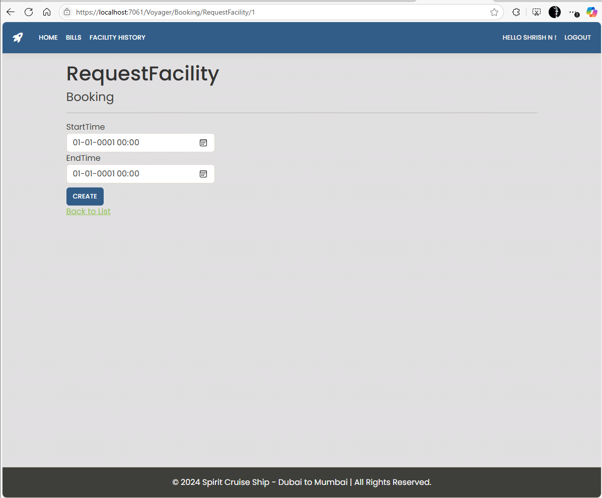
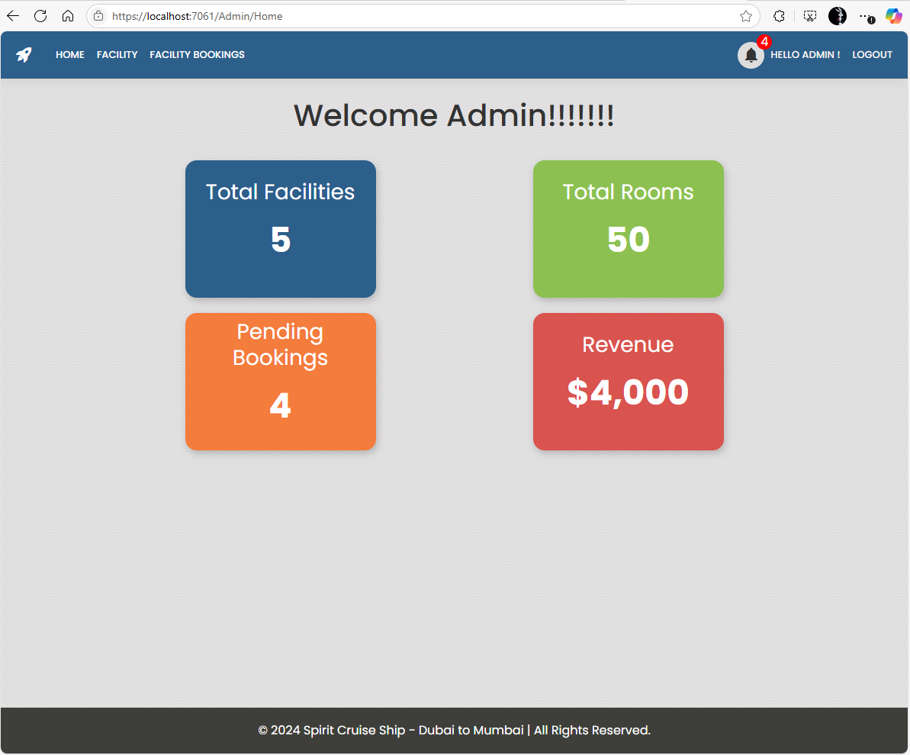

# 🛳️ Cruise Ship Facility Booking System (ASP.NET Core MVC)

A web application for managing facility bookings aboard a cruise ship. Built using ASP.NET Core MVC and Entity Framework Core (Code-First), the system allows voyagers to book, modify, or cancel facilities while admins manage and monitor the booking status and billing.


## 📌 Table of Contents

- [🛳️ Cruise Ship Facility Booking System (ASP.NET Core MVC)](#️-cruise-ship-facility-booking-system-aspnet-core-mvc)
  - [📌 Table of Contents](#-table-of-contents)
  - [📸 Screenshots](#-screenshots)
    - [🏠 Homepage](#-homepage)
    - [📅 Booking Page](#-booking-page)
    - [🧑‍💼 Admin Dashboard](#-admin-dashboard)
  - [✅ Features](#-features)
    - [Admin](#admin)
    - [Voyager (User)](#voyager-user)
  - [🛠 Tech Stack](#-tech-stack)
  - [⚙️ Setup Instructions](#️-setup-instructions)
  - [🗃 Database Design](#-database-design)
  - [🌱 Future Enhancements](#-future-enhancements)
  - [🤝 Contributing](#-contributing)
  - [📄 License](#-license)


## 📸 Screenshots

### 🏠 Homepage


### 📅 Booking Page


### 🧑‍💼 Admin Dashboard



## ✅ Features

### Admin
- View all facility bookings
- Change status of facility bookings (e.g., Approved, Rejected, Completed)
- View bills generated for each booking
- View voyager profiles

### Voyager (User)
- Register/Login
- View available facilities
- Book, reschedule, or cancel facility bookings
- View booking history and status
- View bills for used facilities
- Edit voyager profile details


## 🛠 Tech Stack

- **Frontend:** Razor Views (HTML, CSS, Bootstrap)
- **Backend:** ASP.NET Core MVC
- **Database:** Microsoft SQL Server
- **ORM:** Entity Framework Core (Code-First)
- **IDE:** Visual Studio 2022
- **Version Control:** Git & GitHub


## ⚙️ Setup Instructions

1. **Clone the repository**
   ```bash
   git clone https://github.com/shrishn/CruiseShipManagement.git
   cd cruise-facility-booking   
1. **🛠️ Configure the database connection**

Update `appsettings.json`:

```json
"ConnectionStrings": {
  "DefaultConnection": "Your SQL Server connection string"
} 
```

Apply migrations & update the database
```
dotnet ef database update
```
Run the application
```
dotnet run
```

## 🗃 Database Design

| Table Name        | Description                              |
|-------------------|------------------------------------------|
| Voyagers          | Stores voyager (user) information        |
| Facilities        | Stores details of available facilities   |
| FacilityBookings  | Tracks facility bookings by voyagers     |
| Bills             | Stores billing information for bookings  |

---

## 🌱 Future Enhancements

- Add email confirmations for bookings
- Implement authentication with role-based access
- Add facility availability calendar
- Integrate payment gateway (e.g., Razorpay, Stripe)
- Deploy to cloud (e.g., Azure, AWS)

---

## 🤝 Contributing

Contributions are welcome. Feel free to fork this repo and submit a pull request.

---

## 📄 License

This project is licensed under the MIT License.
